# 3.2 Giải Pháp Thực Hiện - Hệ Thống Đăng Ký Lịch Khám Bệnh Trực Tuyến

## 1. Mô Tả Bài Toán

### 1.1. Bối Cảnh Thực Tế

Trong môi trường y tế truyền thống, bệnh nhân thường gặp nhiều khó khăn khi đến khám bệnh tại bệnh viện:
- **Thời gian chờ đợi lâu**: Bệnh nhân phải xếp hàng từ sáng sớm, chờ đợi hàng giờ để được khám
- **Thiếu thông tin**: Không biết lịch làm việc của bác sĩ, không biết chuyên khoa nào phù hợp với bệnh lý
- **Quá tải**: Bệnh viện khó kiểm soát lượng bệnh nhân, dẫn đến quá tải vào giờ cao điểm
- **Không chủ động**: Bệnh nhân không thể chọn thời gian khám phù hợp với lịch cá nhân

### 1.2. Mục Tiêu Hệ Thống

Xây dựng một nền tảng web cho phép:
- **Bệnh nhân chủ động** tạo lịch khám bệnh phù hợp với thời gian rảnh của mình
- **Bác sĩ theo dõi** danh sách bệnh nhân cần điều trị, tránh tình trạng quá tải
- **Giảm thời gian chờ đợi** cho bệnh nhân thông qua việc phân bổ lịch hẹn hợp lý
- **Quản trị viên kiểm soát** và phê duyệt lịch làm việc của bác sĩ

### 1.3. Phạm Vi Ứng Dụng

Hệ thống phục vụ cho một bệnh viện/phòng khám với:
- Nhiều chuyên khoa (Nội khoa, Ngoại khoa, Tim mạch, Da liễu,...)
- Nhiều bác sĩ thuộc các chuyên khoa khác nhau
- Hàng nghìn bệnh nhân có nhu cầu khám bệnh

---

## 2. Xác Định Yêu Cầu và Mô Tả Chức Năng

### 2.1. Các Vai Trò Người Dùng

| Vai trò | Mã | Mô tả | Cách tạo tài khoản |
|---------|-----|-------|-------------------|
| **Bệnh nhân** | R1 | Người có nhu cầu khám bệnh | Tự đăng ký |
| **Bác sĩ** | R2 | Người cung cấp dịch vụ khám chữa bệnh | Admin tạo |
| **Quản trị viên** | R3 | Người quản lý và vận hành hệ thống | Admin tạo |

### 2.2. Biểu Đồ Use Case Tổng Quan

```mermaid
flowchart TB
    subgraph HT["🏥 HỆ THỐNG ĐĂNG KÝ LỊCH KHÁM BỆNH TRỰC TUYẾN"]
        
        subgraph UC_CHUNG["Chức năng chung"]
            UC1["🔐 Đăng nhập"]
            UC2["👤 Quản lý hồ sơ cá nhân"]
            UC3["🔑 Đổi mật khẩu"]
        end
        
        subgraph UC_BN["Chức năng Bệnh nhân"]
            UC4["📝 Đăng ký tài khoản"]
            UC5["🏥 Xem danh sách chuyên khoa"]
            UC6["👨‍⚕️ Tìm kiếm bác sĩ"]
            UC7["📅 Xem lịch làm việc bác sĩ"]
            UC8["📋 Đặt lịch khám"]
            UC9["📑 Xem lịch hẹn đã đặt"]
            UC10["❌ Hủy lịch hẹn"]
        end
        
        subgraph UC_BS["Chức năng Bác sĩ"]
            UC11["📆 Đăng ký lịch làm việc"]
            UC12["📋 Xem lịch làm việc"]
            UC13["👥 Xem danh sách lịch hẹn"]
            UC14["✅ Xác nhận lịch hẹn"]
            UC15["✔️ Hoàn thành lịch hẹn"]
            UC16["❌ Hủy lịch hẹn BS"]
        end
        
        subgraph UC_AD["Chức năng Admin"]
            UC17["👥 Quản lý người dùng"]
            UC18["🏥 Quản lý chuyên khoa"]
            UC19["✅ Duyệt lịch làm việc"]
            UC20["📆 Tạo lịch trực tiếp"]
            UC21["📊 Quản lý lịch hẹn"]
        end
    end
    
    BN["🧑 Bệnh nhân<br/>(R1)"]
    BS["👨‍⚕️ Bác sĩ<br/>(R2)"]
    AD["👨‍💼 Admin<br/>(R3)"]
    
    BN --> UC1
    BN --> UC2
    BN --> UC3
    BN --> UC4
    BN --> UC5
    BN --> UC6
    BN --> UC7
    BN --> UC8
    BN --> UC9
    BN --> UC10
    
    BS --> UC1
    BS --> UC2
    BS --> UC3
    BS --> UC11
    BS --> UC12
    BS --> UC13
    BS --> UC14
    BS --> UC15
    BS --> UC16
    
    AD --> UC1
    AD --> UC2
    AD --> UC3
    AD --> UC17
    AD --> UC18
    AD --> UC19
    AD --> UC20
    AD --> UC21
```

### 2.3. Biểu Đồ Use Case Chi Tiết Theo Vai Trò

#### 2.3.1. Use Case - Bệnh Nhân (R1)

```mermaid
flowchart LR
    BN["🧑 Bệnh nhân"]
    
    subgraph UC["Use Cases"]
        UC1["Đăng ký tài khoản"]
        UC2["Đăng nhập"]
        UC3["Xem chuyên khoa"]
        UC4["Tìm kiếm bác sĩ"]
        UC5["Xem lịch bác sĩ"]
        UC6["Đặt lịch khám"]
        UC7["Xem lịch hẹn"]
        UC8["Hủy lịch hẹn"]
        UC9["Cập nhật hồ sơ"]
    end
    
    BN --> UC1
    BN --> UC2
    BN --> UC3
    BN --> UC4
    BN --> UC5
    BN --> UC6
    BN --> UC7
    BN --> UC8
    BN --> UC9
    
    UC4 -.->|include| UC3
    UC5 -.->|include| UC4
    UC6 -.->|include| UC5
    UC6 -.->|include| UC2
    UC8 -.->|include| UC7
```

#### 2.3.2. Use Case - Bác Sĩ (R2)

```mermaid
flowchart LR
    BS["👨‍⚕️ Bác sĩ"]
    
    subgraph UC["Use Cases"]
        UC1["Đăng nhập"]
        UC2["Đăng ký lịch làm việc"]
        UC3["Xem lịch làm việc"]
        UC4["Xem lịch hẹn"]
        UC5["Xác nhận lịch hẹn"]
        UC6["Hoàn thành lịch hẹn"]
        UC7["Hủy lịch hẹn"]
        UC8["Cập nhật hồ sơ"]
    end
    
    BS --> UC1
    BS --> UC2
    BS --> UC3
    BS --> UC4
    BS --> UC5
    BS --> UC6
    BS --> UC7
    BS --> UC8
    
    UC2 -.->|include| UC1
    UC5 -.->|include| UC4
    UC6 -.->|include| UC4
    UC7 -.->|include| UC4
```

#### 2.3.3. Use Case - Quản Trị Viên (R3)

```mermaid
flowchart LR
    AD["👨‍💼 Admin"]
    
    subgraph UC["Use Cases"]
        UC1["Đăng nhập"]
        UC2["Quản lý người dùng"]
        UC3["Tạo tài khoản bác sĩ"]
        UC4["Quản lý chuyên khoa"]
        UC5["Duyệt lịch làm việc"]
        UC6["Từ chối lịch làm việc"]
        UC7["Tạo lịch trực tiếp"]
        UC8["Quản lý lịch hẹn"]
    end
    
    AD --> UC1
    AD --> UC2
    AD --> UC3
    AD --> UC4
    AD --> UC5
    AD --> UC6
    AD --> UC7
    AD --> UC8
    
    UC3 -.->|include| UC2
    UC5 -.->|extend| UC7
    UC6 -.->|extend| UC5
```

### 2.4. Yêu Cầu Chức Năng Chi Tiết

#### 2.4.1. Chức Năng Dành Cho Bệnh Nhân (R1)

| STT | Chức năng | Mô tả chi tiết |
|-----|-----------|----------------|
| 1 | Đăng ký tài khoản | Nhập họ tên, email, mật khẩu, số điện thoại, địa chỉ, giới tính. Email phải duy nhất, mật khẩu tối thiểu 6 ký tự |
| 2 | Đăng nhập | Xác thực bằng email và mật khẩu, nhận JWT token có hiệu lực 1 giờ |
| 3 | Xem danh sách chuyên khoa | Duyệt các chuyên khoa với hình ảnh và mô tả |
| 4 | Tìm kiếm bác sĩ | Tìm theo chuyên khoa hoặc xem tất cả bác sĩ |
| 5 | Xem thông tin bác sĩ | Xem chi tiết: họ tên, chức vụ, chuyên khoa, mô tả kinh nghiệm |
| 6 | Xem lịch làm việc bác sĩ | Chỉ hiển thị lịch đã được duyệt (status=approved) và còn chỗ trống |
| 7 | Đặt lịch khám | Chọn bác sĩ, ngày, khung giờ. Hệ thống tạo booking với trạng thái S1 (Chờ xác nhận) |
| 8 | Xem lịch hẹn đã đặt | Danh sách các lịch hẹn với trạng thái: S1, S2, S3, S4 |
| 9 | Hủy lịch hẹn | Chuyển trạng thái sang S3 (Đã hủy), giải phóng slot trong Schedule |
| 10 | Cập nhật thông tin cá nhân | Sửa họ tên, số điện thoại, địa chỉ, ảnh đại diện |

#### 2.4.2. Chức Năng Dành Cho Bác Sĩ (R2)

| STT | Chức năng | Mô tả chi tiết |
|-----|-----------|----------------|
| 1 | Đăng nhập | Xác thực bằng email và mật khẩu do Admin cung cấp |
| 2 | Đăng ký lịch làm việc | Chọn ngày, khung giờ (T1-T8), số bệnh nhân tối đa. Lịch tạo với status=pending |
| 3 | Xem lịch làm việc | Xem tất cả lịch của mình với các trạng thái: pending, approved, rejected |
| 4 | Xem danh sách lịch hẹn | Danh sách bệnh nhân đã đặt lịch, lọc theo ngày |
| 5 | Xác nhận lịch hẹn | Chuyển trạng thái từ S1 sang S2 (Đã xác nhận) |
| 6 | Hoàn thành lịch hẹn | Chuyển trạng thái sang S4 (Đã hoàn thành) sau khi khám xong |
| 7 | Hủy lịch hẹn | Chuyển trạng thái sang S3 khi không thể tiếp nhận |
| 8 | Cập nhật hồ sơ | Sửa thông tin giới thiệu, mô tả kinh nghiệm |

#### 2.4.3. Chức Năng Dành Cho Quản Trị Viên (R3)

| STT | Chức năng | Mô tả chi tiết |
|-----|-----------|----------------|
| 1 | Quản lý người dùng | Xem, tạo, sửa, xóa tài khoản bệnh nhân, bác sĩ, admin |
| 2 | Tạo tài khoản bác sĩ | Nhập thông tin cá nhân + chuyên khoa + mô tả chuyên môn |
| 3 | Quản lý chuyên khoa | Thêm, sửa, xóa chuyên khoa với tên, hình ảnh, mô tả |
| 4 | Duyệt lịch làm việc | Xem danh sách lịch pending, duyệt (approved) hoặc từ chối (rejected) |
| 5 | Tạo lịch trực tiếp | Tạo lịch cho bác sĩ với status=approved ngay lập tức |
| 6 | Quản lý lịch hẹn | Xem tất cả lịch hẹn, cập nhật trạng thái |
| 7 | Xem thống kê | Tổng quan hoạt động hệ thống |

### 2.5. Yêu Cầu Phi Chức Năng

| Yêu cầu | Mô tả |
|---------|-------|
| **Bảo mật** | Mật khẩu mã hóa bcrypt, xác thực JWT, phân quyền RBAC |
| **Hiệu năng** | Phản hồi API < 500ms, hỗ trợ đồng thời 100+ người dùng |
| **Khả dụng** | Uptime 99%, triển khai Docker cho dễ scale |
| **Giao diện** | Responsive, hỗ trợ mobile và desktop |
| **Dữ liệu** | Backup định kỳ, đảm bảo toàn vẹn dữ liệu |

---

## 3. Mô Hình Dữ Liệu

### 3.1. Sơ Đồ Quan Hệ Thực Thể (ERD)

```mermaid
erDiagram
    USERS ||--o{ SCHEDULES : "tạo lịch"
    USERS ||--o{ BOOKINGS : "đặt lịch (patient)"
    USERS ||--o{ BOOKINGS : "nhận lịch (doctor)"
    USERS ||--o| DOCTOR_DETAILS : "có chi tiết"
    USERS }o--|| SPECIALTIES : "thuộc chuyên khoa"
    USERS }o--|| ALLCODES : "có vai trò (roleId)"
    USERS }o--|| ALLCODES : "có chức vụ (positionId)"
    SCHEDULES }o--|| ALLCODES : "khung giờ (timeType)"
    BOOKINGS }o--|| ALLCODES : "trạng thái (statusId)"
    BOOKINGS }o--|| ALLCODES : "khung giờ (timeType)"

    USERS {
        int id PK
        string email UK
        string password
        string firstName
        string lastName
        string phoneNumber
        string address
        boolean gender
        string image
        string roleId FK
        string positionId FK
        int specialtyId FK
        datetime createdAt
        datetime updatedAt
    }

    SCHEDULES {
        int id PK
        int doctorId FK
        date date
        string timeType FK
        int maxNumber
        int currentNumber
        enum status "pending/approved/rejected"
        datetime createdAt
        datetime updatedAt
    }

    BOOKINGS {
        int id PK
        int patientId FK
        int doctorId FK
        date date
        string timeType FK
        string statusId FK
        string token UK
        datetime createdAt
        datetime updatedAt
    }

    SPECIALTIES {
        int id PK
        string name
        string image
        text description
        datetime createdAt
        datetime updatedAt
    }

    DOCTOR_DETAILS {
        int id PK
        int doctorId FK_UK
        text descriptionMarkdown
        text descriptionHTML
        datetime createdAt
        datetime updatedAt
    }

    ALLCODES {
        int id PK
        string keyMap
        string type
        string valueVi
        string valueEn
        datetime createdAt
        datetime updatedAt
    }
```

### 3.2. Chi Tiết Các Bảng Dữ Liệu

#### 3.2.1. Bảng Users (Người dùng)

| Trường | Kiểu dữ liệu | Ràng buộc | Mô tả |
|--------|--------------|-----------|-------|
| id | INTEGER | PK, AUTO_INCREMENT | Khóa chính |
| email | VARCHAR(255) | UNIQUE, NOT NULL | Email đăng nhập |
| password | VARCHAR(255) | NOT NULL | Mật khẩu đã mã hóa bcrypt |
| firstName | VARCHAR(100) | | Tên |
| lastName | VARCHAR(100) | | Họ |
| phoneNumber | VARCHAR(20) | | Số điện thoại |
| address | VARCHAR(255) | | Địa chỉ |
| gender | BOOLEAN | | Giới tính (true: Nam, false: Nữ) |
| image | VARCHAR(255) | | Đường dẫn ảnh đại diện |
| roleId | VARCHAR(10) | FK → Allcode.keyMap | Vai trò: R1, R2, R3 |
| positionId | VARCHAR(10) | FK → Allcode.keyMap | Chức vụ bác sĩ |
| specialtyId | INTEGER | FK → Specialty.id | Chuyên khoa (cho bác sĩ) |

#### 3.2.2. Bảng Schedules (Lịch làm việc)

| Trường | Kiểu dữ liệu | Ràng buộc | Mô tả |
|--------|--------------|-----------|-------|
| id | INTEGER | PK, AUTO_INCREMENT | Khóa chính |
| doctorId | INTEGER | FK → Users.id, NOT NULL | ID bác sĩ |
| date | DATE | NOT NULL | Ngày làm việc |
| timeType | VARCHAR(10) | FK → Allcode.keyMap, NOT NULL | Khung giờ: T1-T8 |
| maxNumber | INTEGER | NOT NULL, DEFAULT 1 | Số bệnh nhân tối đa |
| currentNumber | INTEGER | NOT NULL, DEFAULT 0 | Số đã đặt hiện tại |
| status | ENUM | NOT NULL, DEFAULT 'approved' | pending/approved/rejected |

#### 3.2.3. Bảng Bookings (Lịch hẹn)

| Trường | Kiểu dữ liệu | Ràng buộc | Mô tả |
|--------|--------------|-----------|-------|
| id | INTEGER | PK, AUTO_INCREMENT | Khóa chính |
| patientId | INTEGER | FK → Users.id | ID bệnh nhân |
| doctorId | INTEGER | FK → Users.id | ID bác sĩ |
| date | DATE | | Ngày khám |
| timeType | VARCHAR(10) | FK → Allcode.keyMap | Khung giờ |
| statusId | VARCHAR(10) | FK → Allcode.keyMap | Trạng thái: S1-S4 |
| token | VARCHAR(255) | UNIQUE | Token xác thực (UUID) |

#### 3.2.4. Bảng Specialties (Chuyên khoa)

| Trường | Kiểu dữ liệu | Ràng buộc | Mô tả |
|--------|--------------|-----------|-------|
| id | INTEGER | PK, AUTO_INCREMENT | Khóa chính |
| name | VARCHAR(255) | | Tên chuyên khoa |
| image | VARCHAR(255) | | Hình ảnh |
| description | TEXT | | Mô tả chi tiết |

#### 3.2.5. Bảng DoctorDetails (Chi tiết bác sĩ)

| Trường | Kiểu dữ liệu | Ràng buộc | Mô tả |
|--------|--------------|-----------|-------|
| id | INTEGER | PK, AUTO_INCREMENT | Khóa chính |
| doctorId | INTEGER | FK → Users.id, UNIQUE | ID bác sĩ |
| descriptionMarkdown | TEXT | | Mô tả dạng Markdown |
| descriptionHTML | TEXT | | Mô tả dạng HTML |

#### 3.2.6. Bảng Allcodes (Mã hệ thống)

| Trường | Kiểu dữ liệu | Ràng buộc | Mô tả |
|--------|--------------|-----------|-------|
| id | INTEGER | PK, AUTO_INCREMENT | Khóa chính |
| keyMap | VARCHAR(50) | | Mã định danh |
| type | VARCHAR(50) | | Loại mã: ROLE, TIME, STATUS, POSITION |
| valueVi | VARCHAR(255) | | Giá trị tiếng Việt |
| valueEn | VARCHAR(255) | | Giá trị tiếng Anh |

### 3.3. Dữ Liệu Mã Hệ Thống (Allcodes)

#### Vai trò (type = 'ROLE')
| keyMap | valueVi | valueEn |
|--------|---------|---------|
| R1 | Bệnh nhân | Patient |
| R2 | Bác sĩ | Doctor |
| R3 | Quản trị viên | Admin |

#### Khung giờ (type = 'TIME')
| keyMap | valueVi | valueEn |
|--------|---------|---------|
| T1 | 08:00 - 09:00 | 08:00 - 09:00 |
| T2 | 09:00 - 10:00 | 09:00 - 10:00 |
| T3 | 10:00 - 11:00 | 10:00 - 11:00 |
| T4 | 11:00 - 12:00 | 11:00 - 12:00 |
| T5 | 13:00 - 14:00 | 13:00 - 14:00 |
| T6 | 14:00 - 15:00 | 14:00 - 15:00 |
| T7 | 15:00 - 16:00 | 15:00 - 16:00 |
| T8 | 16:00 - 17:00 | 16:00 - 17:00 |

#### Trạng thái lịch hẹn (type = 'STATUS')
| keyMap | valueVi | valueEn |
|--------|---------|---------|
| S1 | Chờ xác nhận | Pending |
| S2 | Đã xác nhận | Confirmed |
| S3 | Đã hủy | Cancelled |
| S4 | Đã hoàn thành | Completed |

---

## 4. Mô Hình Xử Lý

### 4.1. Kiến Trúc Hệ Thống Tổng Thể

```mermaid
flowchart TB
    subgraph CLIENT["🖥️ CLIENT LAYER"]
        Browser["Web Browser"]
        Mobile["Mobile Browser"]
    end
    
    subgraph FRONTEND["📱 PRESENTATION LAYER - Port 3000"]
        NextJS["Next.js 15<br/>React 18 + TypeScript"]
        Tailwind["Tailwind CSS"]
        Axios["Axios HTTP Client"]
    end
    
    subgraph BACKEND["⚙️ BUSINESS LOGIC LAYER - Port 8080"]
        Express["Express.js Router"]
        Controllers["Controllers"]
        Middleware["Middleware<br/>(Auth/RBAC)"]
        Sequelize["Sequelize ORM"]
    end
    
    subgraph DATABASE["🗄️ DATA LAYER - Port 3306"]
        MySQL["MySQL 8.0<br/>Database: DBDKKHAMBENH"]
    end
    
    Browser --> NextJS
    Mobile --> NextJS
    NextJS --> Tailwind
    NextJS --> Axios
    Axios -->|REST API| Express
    Express --> Middleware
    Middleware --> Controllers
    Controllers --> Sequelize
    Sequelize --> MySQL
```

### 4.2. Sơ Đồ Tuần Tự - Đăng Ký Lịch Làm Việc (Hybrid Approval)

```mermaid
sequenceDiagram
    autonumber
    actor BS as 👨‍⚕️ Bác sĩ
    participant FE as 📱 Frontend
    participant BE as ⚙️ Backend
    participant DB as 🗄️ Database
    actor AD as 👨‍💼 Admin

    Note over BS,AD: QUY TRÌNH BÁC SĨ ĐĂNG KÝ LỊCH LÀM VIỆC
    
    BS->>FE: Chọn ngày, khung giờ, số BN tối đa
    FE->>BE: POST /api/schedules<br/>{doctorId, date, timeType, maxNumber}
    BE->>DB: SELECT * FROM Schedules<br/>WHERE doctorId, date, timeType
    DB-->>BE: Kết quả kiểm tra trùng
    
    alt Lịch đã tồn tại
        BE-->>FE: 400 - Lịch đã tồn tại
        FE-->>BS: ❌ Thông báo lỗi
    else Lịch chưa tồn tại
        BE->>DB: INSERT INTO Schedules<br/>status = 'pending'
        DB-->>BE: Schedule created
        BE-->>FE: 201 - Đăng ký thành công, chờ duyệt
        FE-->>BS: ✅ Lịch đang chờ Admin duyệt
    end

    Note over BS,AD: QUY TRÌNH ADMIN DUYỆT LỊCH
    
    AD->>FE: Truy cập trang quản lý lịch
    FE->>BE: GET /api/schedules/pending
    BE->>DB: SELECT * FROM Schedules<br/>WHERE status = 'pending'
    DB-->>BE: Danh sách lịch chờ duyệt
    BE-->>FE: 200 - Pending schedules
    FE-->>AD: 📋 Hiển thị danh sách

    AD->>FE: Click "Duyệt" lịch
    FE->>BE: PUT /api/schedules/:id/approve
    BE->>DB: UPDATE Schedules<br/>SET status = 'approved'
    DB-->>BE: Updated
    BE-->>FE: 200 - Duyệt thành công
    FE-->>AD: ✅ Lịch đã được duyệt
    
    Note over BS,AD: Lịch đã duyệt sẽ hiển thị cho bệnh nhân đặt khám
```

### 4.3. Sơ Đồ Tuần Tự - Đặt Lịch Khám Bệnh

```mermaid
sequenceDiagram
    autonumber
    actor BN as 🧑 Bệnh nhân
    participant FE as 📱 Frontend
    participant BE as ⚙️ Backend
    participant DB as 🗄️ Database
    actor BS as 👨‍⚕️ Bác sĩ

    Note over BN,BS: QUY TRÌNH BỆNH NHÂN ĐẶT LỊCH KHÁM

    BN->>FE: Chọn chuyên khoa
    FE->>BE: GET /api/doctors/specialty/:specialtyId
    BE->>DB: SELECT * FROM Users<br/>WHERE specialtyId AND roleId='R2'
    DB-->>BE: Danh sách bác sĩ
    BE-->>FE: 200 - Doctors list
    FE-->>BN: 👨‍⚕️ Hiển thị danh sách bác sĩ

    BN->>FE: Chọn bác sĩ, xem lịch
    FE->>BE: GET /api/schedules/doctor/:doctorId
    BE->>DB: SELECT * FROM Schedules<br/>WHERE status='approved'<br/>AND currentNumber < maxNumber
    DB-->>BE: Lịch còn trống
    BE-->>FE: 200 - Available schedules
    FE-->>BN: 📅 Hiển thị lịch còn trống

    BN->>FE: Chọn khung giờ, đặt lịch
    FE->>BE: POST /api/bookings<br/>{doctorId, patientId, date, timeType}
    BE->>BE: Generate UUID token
    BE->>DB: INSERT INTO Bookings<br/>statusId='S1', token=UUID
    DB-->>BE: Booking created
    BE-->>FE: 201 - Đặt lịch thành công
    FE-->>BN: ✅ Đặt lịch thành công, chờ xác nhận

    Note over BN,BS: QUY TRÌNH BÁC SĨ XÁC NHẬN LỊCH HẸN

    BS->>FE: Xem danh sách lịch hẹn
    FE->>BE: GET /api/bookings/doctor/:doctorId
    BE->>DB: SELECT * FROM Bookings<br/>WHERE doctorId
    DB-->>BE: Danh sách lịch hẹn
    BE-->>FE: 200 - Bookings list
    FE-->>BS: 📋 Hiển thị lịch hẹn

    BS->>FE: Click "Xác nhận"
    FE->>BE: PUT /api/bookings/:id/status<br/>{statusId: 'S2'}
    BE->>DB: UPDATE Bookings SET statusId='S2'
    BE->>DB: UPDATE Schedules<br/>SET currentNumber += 1
    DB-->>BE: Updated
    BE-->>FE: 200 - Xác nhận thành công
    FE-->>BS: ✅ Đã xác nhận lịch hẹn
```

### 4.4. Sơ Đồ Tuần Tự - Xác Thực JWT

```mermaid
sequenceDiagram
    autonumber
    actor User as 👤 Người dùng
    participant FE as 📱 Frontend
    participant BE as ⚙️ Backend
    participant MW as 🔐 Middleware
    participant DB as 🗄️ Database

    Note over User,DB: QUY TRÌNH ĐĂNG NHẬP

    User->>FE: Nhập email, password
    FE->>BE: POST /api/auth/login<br/>{email, password}
    BE->>DB: SELECT * FROM Users<br/>WHERE email
    DB-->>BE: User data
    
    alt Email không tồn tại
        BE-->>FE: 401 - Email không tồn tại
        FE-->>User: ❌ Sai email
    else Email tồn tại
        BE->>BE: bcrypt.compare(password, hash)
        alt Sai mật khẩu
            BE-->>FE: 401 - Mật khẩu không đúng
            FE-->>User: ❌ Sai mật khẩu
        else Đúng mật khẩu
            BE->>BE: jwt.sign({userId, email, role}, secret, {expiresIn: '1h'})
            BE-->>FE: 200 - {token, user}
            FE->>FE: localStorage.setItem('token', token)
            FE-->>User: ✅ Đăng nhập thành công
        end
    end

    Note over User,DB: QUY TRÌNH GỌI API CÓ XÁC THỰC

    User->>FE: Thực hiện thao tác
    FE->>FE: Lấy token từ localStorage
    FE->>BE: GET /api/protected<br/>Header: Authorization: Bearer {token}
    BE->>MW: verifyToken middleware
    MW->>MW: jwt.verify(token, secret)
    
    alt Token không hợp lệ/hết hạn
        MW-->>BE: Token invalid
        BE-->>FE: 401 - Unauthorized
        FE-->>User: 🔄 Yêu cầu đăng nhập lại
    else Token hợp lệ
        MW->>MW: Decode payload {userId, role}
        MW->>BE: req.user = decoded
        BE->>MW: authMiddleware (check role)
        alt Không đủ quyền
            MW-->>BE: Forbidden
            BE-->>FE: 403 - Không có quyền
            FE-->>User: ⛔ Không có quyền truy cập
        else Đủ quyền
            BE->>DB: Execute query
            DB-->>BE: Data
            BE-->>FE: 200 - Response data
            FE-->>User: ✅ Hiển thị dữ liệu
        end
    end
```

### 4.5. Sơ Đồ Tuần Tự - Hủy Lịch Hẹn

```mermaid
sequenceDiagram
    autonumber
    actor BN as 🧑 Bệnh nhân
    participant FE as 📱 Frontend
    participant BE as ⚙️ Backend
    participant DB as 🗄️ Database

    Note over BN,DB: QUY TRÌNH HỦY LỊCH HẸN

    BN->>FE: Xem danh sách lịch hẹn
    FE->>BE: GET /api/bookings/patient/:patientId
    BE->>DB: SELECT * FROM Bookings WHERE patientId
    DB-->>BE: Danh sách lịch hẹn
    BE-->>FE: 200 - Bookings
    FE-->>BN: 📋 Hiển thị lịch hẹn

    BN->>FE: Click "Hủy lịch"
    FE->>FE: Hiển thị confirm dialog
    BN->>FE: Xác nhận hủy
    
    FE->>BE: PUT /api/bookings/:id/status<br/>{statusId: 'S3'}
    BE->>DB: SELECT * FROM Bookings WHERE id
    DB-->>BE: Booking data
    
    BE->>DB: UPDATE Bookings<br/>SET statusId = 'S3'
    
    BE->>DB: SELECT * FROM Schedules<br/>WHERE doctorId, date, timeType
    DB-->>BE: Schedule data
    
    alt Trước đó đã xác nhận (S2)
        BE->>DB: UPDATE Schedules<br/>SET currentNumber -= 1
        Note over BE,DB: Giải phóng slot cho người khác đặt
    end
    
    DB-->>BE: Updated
    BE-->>FE: 200 - Hủy thành công
    FE-->>BN: ✅ Đã hủy lịch hẹn
```

### 4.6. Sơ Đồ Trạng Thái - Lịch Làm Việc (Schedule)

```mermaid
stateDiagram-v2
    [*] --> Pending: Bác sĩ tạo lịch
    
    Pending --> Approved: Admin duyệt
    Pending --> Rejected: Admin từ chối
    
    Approved --> [*]: Xóa lịch
    Rejected --> [*]: Xóa lịch
    
    note right of Pending
        Lịch chờ Admin xem xét
        Chưa hiển thị cho bệnh nhân
    end note
    
    note right of Approved
        Lịch đã duyệt
        Hiển thị cho bệnh nhân đặt
    end note
    
    note right of Rejected
        Lịch bị từ chối
        Bác sĩ cần đăng ký lại
    end note
```

### 4.7. Sơ Đồ Trạng Thái - Lịch Hẹn (Booking)

```mermaid
stateDiagram-v2
    [*] --> S1: Bệnh nhân đặt lịch
    
    S1 --> S2: Bác sĩ/Admin xác nhận
    S1 --> S3: Bệnh nhân/Bác sĩ hủy
    
    S2 --> S4: Khám xong
    S2 --> S3: Bệnh nhân/Bác sĩ hủy
    
    S3 --> [*]: Kết thúc
    S4 --> [*]: Kết thúc
    
    note right of S1
        Chờ xác nhận
        (Pending)
    end note
    
    note right of S2
        Đã xác nhận
        (Confirmed)
        currentNumber += 1
    end note
    
    note right of S3
        Đã hủy
        (Cancelled)
        currentNumber -= 1 (nếu từ S2)
    end note
    
    note right of S4
        Đã hoàn thành
        (Completed)
    end note
```

### 4.8. API Endpoints

| Module | Method | Endpoint | Mô tả | Quyền |
|--------|--------|----------|-------|-------|
| **Auth** | POST | /api/auth/login | Đăng nhập | Public |
| **Auth** | POST | /api/auth/register | Đăng ký bệnh nhân | Public |
| **Users** | GET | /api/users | Danh sách người dùng | R3 |
| **Users** | POST | /api/users | Tạo người dùng | R3 |
| **Users** | PUT | /api/users/:id | Cập nhật người dùng | R3 |
| **Users** | DELETE | /api/users/:id | Xóa người dùng | R3 |
| **Doctors** | GET | /api/doctors | Danh sách bác sĩ | Public |
| **Doctors** | GET | /api/doctors/:id | Chi tiết bác sĩ | Public |
| **Doctors** | GET | /api/doctors/specialty/:id | Bác sĩ theo chuyên khoa | Public |
| **Schedules** | GET | /api/schedules/doctor/:id | Lịch làm việc bác sĩ | Public |
| **Schedules** | POST | /api/schedules | Tạo lịch làm việc | R2, R3 |
| **Schedules** | GET | /api/schedules/pending | Lịch chờ duyệt | R3 |
| **Schedules** | PUT | /api/schedules/:id/approve | Duyệt lịch | R3 |
| **Schedules** | PUT | /api/schedules/:id/reject | Từ chối lịch | R3 |
| **Bookings** | POST | /api/bookings | Đặt lịch khám | R1 |
| **Bookings** | GET | /api/bookings/patient/:id | Lịch hẹn của bệnh nhân | R1 |
| **Bookings** | GET | /api/bookings/doctor/:id | Lịch hẹn của bác sĩ | R2 |
| **Bookings** | PUT | /api/bookings/:id/status | Cập nhật trạng thái | R2, R3 |
| **Bookings** | DELETE | /api/bookings/:id | Hủy lịch hẹn | R1, R2, R3 |
| **Specialties** | GET | /api/specialty | Danh sách chuyên khoa | Public |
| **Specialties** | POST | /api/specialty | Tạo chuyên khoa | R3 |
| **Specialties** | PUT | /api/specialty/:id | Cập nhật chuyên khoa | R3 |
| **Specialties** | DELETE | /api/specialty/:id | Xóa chuyên khoa | R3 |

### 4.9. Công Nghệ Sử Dụng


---

## 5. Quy Trình Xử Lý Tình Huống Đặc Biệt

### 5.1. Bác Sĩ Nghỉ Ốm / Không Thể Làm Việc

```mermaid
flowchart TD
    A[Bác sĩ nghỉ ốm] --> B{Lịch hẹn đã<br/>được xác nhận?}
    
    B -->|Chưa xác nhận S1| C[Bác sĩ không nhận lịch]
    C --> D[Lịch hẹn giữ trạng thái S1]
    D --> E[Bệnh nhân có thể hủy<br/>và đặt lịch khác]
    
    B -->|Đã xác nhận S2| F[Bác sĩ hủy lịch hẹn]
    F --> G[Chuyển trạng thái → S3]
    G --> H[Thông báo bệnh nhân<br/>qua Email/SMS]
    H --> I[Bệnh nhân đặt lịch mới]
    
    style A fill:#ffcccc
    style H fill:#ffffcc
```

**Quy trình chi tiết:**
1. **Trường hợp chưa xác nhận (S1)**: Bác sĩ chỉ cần không nhận lịch khám. Bệnh nhân sẽ thấy lịch vẫn ở trạng thái "Chờ xác nhận" và có thể chủ động hủy để đặt lịch với bác sĩ khác.
2. **Trường hợp đã xác nhận (S2)**: Bác sĩ hoặc Admin hủy lịch hẹn, hệ thống gửi thông báo đến bệnh nhân qua email hoặc số điện thoại đã đăng ký.

### 5.2. Bệnh Nhân Không Đến Khám (No-Show)

```mermaid
flowchart TD
    A[Đến giờ khám] --> B{Bệnh nhân<br/>có mặt?}
    
    B -->|Có| C[Bác sĩ khám bệnh]
    C --> D[Cập nhật S4 - Hoàn thành]
    
    B -->|Không| E[Hết khung giờ quy định]
    E --> F[Chuyển trạng thái → S3 Đã hủy]
    F --> G[Giải phóng slot]
    
    G --> H{Bệnh nhân đến<br/>sau giờ?}
    H -->|Có| I{Trường hợp<br/>đặc biệt?}
    I -->|Không| J[Không được khám<br/>Cần đặt lịch mới]
    I -->|Cấp cứu| K[Chuyển qua<br/>khoa Cấp cứu]
    
    H -->|Không| L[Kết thúc]
    
    style E fill:#ffcccc
    style K fill:#ccffcc
```

**Quy tắc xử lý:**
- Nếu bệnh nhân không đến trong khung giờ quy định → Tự động chuyển trạng thái sang S3 (Đã hủy)
- Bệnh nhân đến sau giờ → Không được khám, cần đặt lịch mới
- Trường hợp cấp cứu → Chuyển qua khoa Cấp cứu, không qua hệ thống đặt lịch

### 5.3. Xử Lý Xung Đột Đặt Lịch (Race Condition)

```mermaid
sequenceDiagram
    autonumber
    actor BN1 as 🧑 Bệnh nhân 1
    actor BN2 as 🧑 Bệnh nhân 2
    participant BE as ⚙️ Backend
    participant DB as 🗄️ Database

    Note over BN1,DB: Tình huống: 2 bệnh nhân đặt cùng slot cuối cùng

    par Đặt lịch đồng thời
        BN1->>BE: POST /api/bookings (slot cuối)
        BN2->>BE: POST /api/bookings (slot cuối)
    end

    BE->>DB: BEGIN TRANSACTION
    BE->>DB: SELECT ... FOR UPDATE<br/>(Lock row)
    
    Note over DB: Row bị khóa, chỉ 1 request được xử lý
    
    DB-->>BE: currentNumber = 4, maxNumber = 5
    BE->>BE: Check: 4 < 5 ✓
    BE->>DB: INSERT Booking (BN1)
    BE->>DB: UPDATE currentNumber = 5
    BE->>DB: COMMIT
    BE-->>BN1: ✅ Đặt lịch thành công

    Note over DB: Row được mở khóa, request tiếp theo được xử lý
    
    BE->>DB: BEGIN TRANSACTION
    BE->>DB: SELECT ... FOR UPDATE
    DB-->>BE: currentNumber = 5, maxNumber = 5
    BE->>BE: Check: 5 < 5 ✗
    BE->>DB: ROLLBACK
    BE-->>BN2: ❌ Slot đã đầy
```

**Cơ chế bảo vệ:**
- Sử dụng **Database Transaction** với **Row-level Locking** (SELECT ... FOR UPDATE)
- Đảm bảo chỉ một request được xử lý tại một thời điểm cho cùng một slot
- Kiểm tra `currentNumber < maxNumber` trong transaction trước khi tạo booking

### 5.4. Quy Trình Đăng Ký và Duyệt Lịch Làm Việc

```mermaid
flowchart TD
    A[Bác sĩ đăng ký lịch] --> B{Ngày đăng ký<br/>hợp lệ?}
    
    B -->|< Ngày mai| C[❌ Từ chối<br/>Phải đăng ký từ ngày mai]
    B -->|>= Ngày mai| D[Tạo lịch status=pending]
    
    D --> E[Admin nhận thông báo]
    E --> F{Admin duyệt<br/>trong 1 ngày?}
    
    F -->|Duyệt| G[status = approved]
    G --> H[Hiển thị cho bệnh nhân]
    
    F -->|Từ chối| I[status = rejected]
    I --> J[Bác sĩ đăng ký lại]
    
    F -->|Quá hạn| K[⚠️ Cảnh báo Admin]
    K --> F
    
    style C fill:#ffcccc
    style G fill:#ccffcc
    style K fill:#ffffcc
```

**Quy tắc thời gian:**
| Hành động | Thời gian quy định |
|-----------|-------------------|
| Bác sĩ đăng ký lịch | Tối thiểu 1 ngày trước (từ ngày mai trở đi) |
| Admin duyệt lịch | Trong vòng 1 ngày sau khi bác sĩ đăng ký |
| Khuyến nghị | Bác sĩ nên đăng ký trước 1 tuần để có thời gian duyệt |

### 5.5. Sơ Đồ Tổng Hợp Luồng Nghiệp Vụ

```mermaid
flowchart TB
    subgraph DANG_KY["📅 ĐĂNG KÝ LỊCH LÀM VIỆC"]
        BS1[Bác sĩ đăng ký] --> |>= ngày mai| P1[Pending]
        P1 --> |Admin duyệt| A1[Approved]
        P1 --> |Admin từ chối| R1[Rejected]
    end
    
    subgraph DAT_LICH["📋 ĐẶT LỊCH KHÁM"]
        A1 --> |Còn slot| BN1[Bệnh nhân đặt]
        BN1 --> S1[S1: Chờ xác nhận]
    end
    
    subgraph XU_LY["⚙️ XỬ LÝ LỊCH HẸN"]
        S1 --> |BS xác nhận| S2[S2: Đã xác nhận]
        S1 --> |BS không nhận| S1
        S1 --> |BN/BS hủy| S3[S3: Đã hủy]
        
        S2 --> |Khám xong| S4[S4: Hoàn thành]
        S2 --> |BN/BS hủy| S3
        S2 --> |No-show| S3
    end
    
    subgraph TINH_HUONG["⚠️ TÌNH HUỐNG ĐẶC BIỆT"]
        TH1[BS nghỉ ốm] --> |Chưa xác nhận| S1
        TH1 --> |Đã xác nhận| S3
        TH2[BN không đến] --> S3
        TH3[Cấp cứu] --> CC[Khoa Cấp cứu]
    end
    
    style A1 fill:#ccffcc
    style S4 fill:#ccffcc
    style S3 fill:#ffcccc
    style CC fill:#ffffcc
```

---

## 6. Tổng Kết

Hệ thống Đăng Ký Lịch Khám Bệnh Trực Tuyến được thiết kế với:

1. **Mô hình dữ liệu** chuẩn hóa với 6 bảng chính, sử dụng bảng Allcodes để quản lý các mã hệ thống linh hoạt

2. **Kiến trúc 3 lớp** rõ ràng: Presentation (Next.js) - Business Logic (Express.js) - Data (MySQL)

3. **Quy trình duyệt Hybrid** cho phép bác sĩ chủ động đăng ký lịch, Admin kiểm soát phê duyệt

4. **Bảo mật** với JWT authentication và Role-Based Access Control (RBAC)

5. **Xử lý tình huống đặc biệt** bao gồm:
   - Bác sĩ nghỉ ốm: Không xác nhận hoặc hủy lịch + thông báo bệnh nhân
   - Bệnh nhân không đến: Tự động hủy sau khung giờ quy định
   - Race condition: Sử dụng Transaction + Row-level Locking
   - Quy trình duyệt: Bác sĩ đăng ký >= ngày mai, Admin duyệt trong 1 ngày

6. **Khả năng mở rộng** với Docker containerization và thiết kế module hóa

### 6.1. Tính Năng Phát Triển Tương Lai

| Tính năng | Mô tả | Ưu tiên |
|-----------|-------|---------|
| Thông báo Email/SMS | Gửi thông báo tự động khi có thay đổi lịch hẹn | Cao |
| Thanh toán trực tuyến | Tích hợp cổng thanh toán (VNPay, Momo) | Trung bình |
| Đánh giá bác sĩ | Bệnh nhân đánh giá sau khi khám | Trung bình |
| Tư vấn trực tuyến | Video call với bác sĩ | Thấp |
| Hồ sơ bệnh án điện tử | Lưu trữ lịch sử khám bệnh | Cao |


---

## Phụ Lục: Hướng Dẫn Cài Đặt

### Yêu Cầu
- Docker 20.10+
- Docker Compose 2.0+

### Cài Đặt Nhanh

```bash
# 1. Clone dự án
git clone https://github.com/TongNguyenvk/CNPM_WebSiteDKKhamBenh.git
cd CNPM_WebSiteDKKhamBenh

# 2. Tạo volume database
docker volume create websitedkkhambenh_db_data

# 3. Build và chạy
docker-compose up -d --build

# 4. Kiểm tra
docker-compose ps
```

### Truy Cập

| URL | Mô tả |
|-----|-------|
| http://localhost:3000 | Giao diện web |
| http://localhost:8080/api | Backend API |

### Import Dữ Liệu (nếu có file dump)

```bash
docker-compose exec -T db-mysql mysql -u root -p123456 DBDKKHAMBENH < dump-DBDKKHAMBENH-*.sql
```

### Tài Khoản Mặc Định

| Vai trò | Email | Mật khẩu |
|---------|-------|----------|
| Admin | admin@gmail.com | 123456 |
